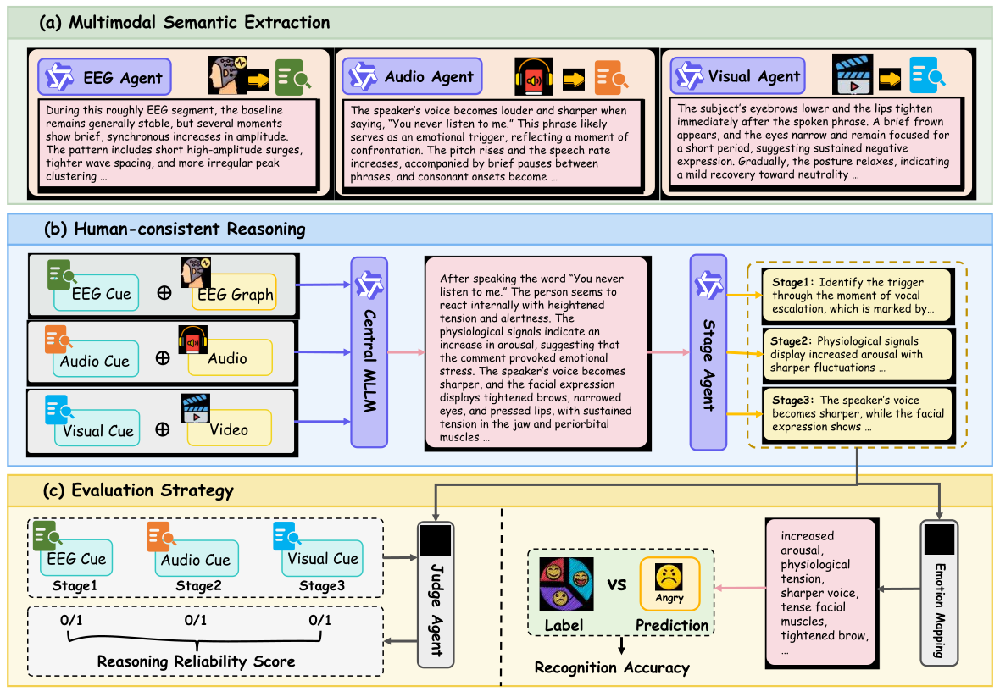

# PH-EMO: Decoding Emotions from the Brain Inward – EEG-Grounded Multimodal Reasoning with LLMs


Welcome to the official repository for the paper "PH-EMO: Decoding Emotions from the Brain Inward – EEG-Grounded Multimodal Reasoning with LLMs" published in WWW'26. PH-EMO is a human-consistent multimodal emotion understanding framework that integrates **EEG, audio, and video** signals through a **sequential causal reasoning process**.  [[paper]([https://github.com/KehongBeyondMask/PH-EMO](https://github.com/KehongBeyondMask/PH-EMO/blob/main/phemo_www26.pdf))]
Instead of directly predicting emotion labels, PH-EMO explicitly models how emotions emerge through:

> **Trigger → Physiological Cues → Expressive Behavior**


---

## 🔥 Key Features

<p align="center">
  
</p>

<!-- <p align="center">
  <b></b> Overview of the PHEMO framework.
</p> -->


- 🧠 **Sequential causal reasoning** over multimodal inputs  
- 🤖 Modular **Agent-based design** (EEG / Audio / Visual / Reasoner / Judge)  
- 📊 Evaluation with **Accuracy, F1-score, and Reasoning Reliability Score (RRS)**  
- 🔌 Backend-agnostic: supports OpenAI API, Qwen, local LLMs, or other MLLMs  
- 📈 Supports benchmark datasets such as **EAV** and **LUMED-2**

---

## 📂 Repository Structure

```

PH-EMO/
├── configs/               # Default configurations
├── data/                  # Place datasets here (EAV / LUMED-2)
├── outputs/               # Logs and inference outputs
├── src/
│   ├── agents.py          # Agent definitions
│   ├── prompts.py         # Prompt templates
│   ├── pipeline.py        # End-to-end reasoning pipeline
│   ├── metrics.py         # ACC / F1 / RRS
│   ├── run_eval.py        # Evaluation script
│   ├── datasets/
│   │   ├── eav.py         # EAV dataset loader
│   │   └── lumed2.py      # LUMED-2 dataset loader
├── requirements.txt
├── README.md
└── LICENSE

````

---

## ⚙️ Installation

### 1. Clone the repository

```bash
git clone https://github.com/KehongBeyondMask/PH-EMO.git
cd PH-EMO
````

### 2. Install dependencies

We recommend **Python ≥ 3.9**.

```bash
pip install -r requirements.txt
```

### 3. Configure LLM backend

This repository does **not** hard-code any specific LLM provider.
You may use:

* OpenAI API (e.g., GPT-4o)
* Alibaba Qwen (local or DashScope)
* Any local MLLM via `transformers` / `vLLM`

Set required environment variables, e.g.:

```bash
export OPENAI_API_KEY="your_api_key"
```

---

## 🚀 Quick Start

### Example: Running evaluation on EAV

Assume your dataset is organized as:

```
data/eav/
├── eeg/
├── audio/
└── video/
```

#### Python Example

```python
from src.run_eval import run_eval
from src.pipeline import PHEMOPipeline
from src.agents import (
    LLMBackend, PerceptionAgent,
    CentralReasoner, EmotionMappingAgent, JudgeAgent
)
from src.datasets.eav import EAVDataset
from src.prompts import *

# Define backend (implement generate() with your LLM API)
backend = LLMBackend(name="openai-gpt4o")

# Define agents
eeg_agent = PerceptionAgent(backend, EEG_PROMPT)
audio_agent = PerceptionAgent(backend, AUDIO_PROMPT)
visual_agent = PerceptionAgent(backend, VISUAL_PROMPT)

reasoner = CentralReasoner(backend, COT_PROMPT)

mapper = EmotionMappingAgent(
    backend,
    EMOTION_MAPPING_PROMPT,
    label_set=["happy", "sad", "neutral", "fear", "anger"]
)

judge = JudgeAgent(backend, JUDGE_PROMPT)

# Load dataset
dataset = EAVDataset(root="data/eav")

# Build pipeline
pipeline = PHEMOPipeline(
    eeg_agent=eeg_agent,
    audio_agent=audio_agent,
    visual_agent=visual_agent,
    reasoner=reasoner,
    mapper=mapper,
    judge=judge
)

# Run evaluation
results = run_eval(
    pipeline,
    dataset,
    out_jsonl="outputs/eav_results.jsonl"
)

print(results)
```

---

## 🧠 Framework Overview

PH-EMO consists of five agents:

1. **EEG Perception Agent**
   Extracts neural cues from EEG waveform graphs.

2. **Audio Perception Agent**
   Analyzes vocal tone, prosody, and semantic content.

3. **Visual Perception Agent**
   Captures facial expressions, micro-movements, and visual context.

4. **Central Reasoning Agent**
   Performs **three-stage causal reasoning**:

   * Stage 1: Trigger (external event)
   * Stage 2: Physiological state (internal affect)
   * Stage 3: Expressive behavior (observable response)

5. **Judge Agent**
   Evaluates whether each reasoning stage is consistent with its corresponding evidence and computes **RRS**.

---

## 📊 Evaluation Metrics

* **Accuracy (ACC)**
* **Weighted F1-score**
* **Reasoning Reliability Score (RRS)**

RRS is defined as:

$$
\mathrm{RRS} = \frac{1}{3N} \sum_{i=1}^{N} \sum_{j=1}^{3} r_{i,j}
$$


where $( r_{i,j} \in {0,1} )$ indicates whether the Judge Agent finds stage $( j )$ of sample $( i )$ consistent with its evidence.

Implementation can be found in `src/metrics.py`.

---

## 📦 Supported Datasets

| Dataset | Modalities          | Classes |
| ------- | ------------------- | ------- |
| EAV     | EEG + Audio + Video | 5       |
| LUMED-2 | EEG + Video         | 3       |

You may easily extend this framework to new datasets by implementing a custom loader that returns:

```python
{
  "eeg_graph_img": ...,
  "audio_clip": ...,
  "video_clip": ...,
  "y_true": ...
}
```

---


## 📚 Citation

If you use this repository in your research, please cite:

```bibtex
@inproceedings{phemo2026,
  title={PH-EMO: Decoding Emotions from the Brain Inward – EEG-Grounded Multimodal Reasoning with LLMs},
  author={Kehong Liu, Yang Liu, Jiming Liu},
  booktitle={Proceedings of the Web Conference (WWW) Companion},
  year={2026}
}
```

---

## 📜 License

This project is released under the **MIT License**.

---

## 🤝 Contact

For questions or collaborations, feel free to open an issue or contact the authors.


